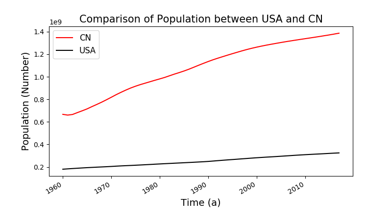

# World Data Atlas (Knoema) Spider

通过 [Knoema](https://knoema.com/atlas) 获取 **某国家/地区** 的 **某指标** 的 **不同年份** 的数据。

- 可获取数据的国家/地区见 [`./knoema/source_data/countries.json`](https://github.com/Tishacy/WorldDataAtlas/blob/master/knoema/source_data/countries.json)。
- 可获取数据的指标见[`./knoema/source_data/indicators.json`](https://github.com/Tishacy/WorldDataAtlas/blob/master/knoema/source_data/indicators.json)。

目录树如下：

```bash
.
├── demo.py                     # 简单的demo
├── demo.png
├── handbook.ipynb              # handbook (jupyter notebook)
├── knoema                      # 爬虫主目录
│   ├── __init__.py
│   ├── knoema.py               # 爬虫主文件
│   ├── source_data             # 爬虫源数据
│   │   ├── countries.json
│   │   ├── get_count_id.py
│   │   ├── get_indic_id.py
│   │   └── indicators.json
│   └── utils.py                # 爬虫工具函数模块
├── README.md
├── LICENSE
└── requirements.txt
```

## Pre-requirements

1. 克隆至本地。

    ```bash
    $ git clone https://github.com/Tishacy/WorldDataAtlas.git
    $ cd WorldDataAtlas
    ```

2. 依赖库如下：

    ```bash
    mspider==0.2.5
    numpy==1.13.3
    pandas==0.24.2
    requests==2.18.4
    matplotlib==3.0.1
    beautifulsoup4==4.7.1
    ```
    安装依赖：

    ```bash
    $ pip install -r requirements.txt
    ```

## Usage

### 运行demo

`demo.py`：获取中国和美国的GDP数据并绘制图像。

```bash
$ python3 demo.py
```

若见下图，则运行成功。



### 具体用法

**见[`handbook.ipynb`](http://nbviewer.jupyter.org/github/Tishacy/WorldDataAtlas/blob/master/handbook.ipynb)。**


## License

Copyright (c) 2019 tishacy.

Licensed under the [MIT License](https://github.com/Tishacy/WorldDataAtlas/blob/master/LICENSE).